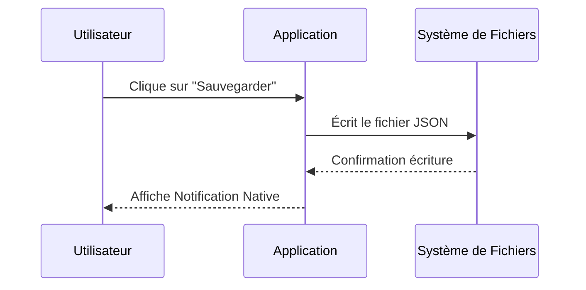

# electron-vite-react

[](https://github.com/vitejs/awesome-vite)


[](https://nodejs.org/about/releases)

English | [简体中文](README.zh-CN.md)

## 👀 Overview

📦 Ready out of the box  
🎯 Based on the official [template-react-ts](https://github.com/vitejs/vite/tree/main/packages/create-vite/template-react-ts), project structure will be familiar to you  
🌱 Easily extendable and customizable  
💪 Supports Node.js API in the renderer process  
🔩 Supports C/C++ native addons  
🐞 Debugger configuration included  
🖥 Easy to implement multiple windows  

## 🛫 Quick Setup

```sh
# clone the project
git clone https://github.com/electron-vite/electron-vite-react.git

# enter the project directory
cd electron-vite-react

# install dependency
npm install

# develop
npm run dev
```

## 🐞 Debug


## 📂 Directory structure

Familiar React application structure, just with `electron` folder on the top :wink:  
*Files in this folder will be separated from your React application and built into `dist-electron`*  

```tree
├── electron                                 Electron-related code
│   ├── main                                 Main-process source code
│   └── preload                              Preload-scripts source code
│
├── release                                  Generated after production build, contains executables
│   └── {version}
│       ├── {os}-{os_arch}                   Contains unpacked application executable
│       └── {app_name}_{version}.{ext}       Installer for the application
│
├── public                                   Static assets
└── src                                      Renderer source code, your React application
```

<!--
## 🚨 Be aware

This template integrates Node.js API to the renderer process by default. If you want to follow **Electron Security Concerns** you might want to disable this feature. You will have to expose needed API by yourself.  

To get started, remove the option as shown below. This will [modify the Vite configuration and disable this feature](https://github.com/electron-vite/vite-plugin-electron-renderer#config-presets-opinionated).

```diff
# vite.config.ts

export default {
  plugins: [
    ...
-   // Use Node.js API in the Renderer-process
-   renderer({
-     nodeIntegration: true,
-   }),
    ...
  ],
}
```
-->

## 🔧 Additional features

1. electron-updater 👉 [see docs](src/components/update/README.md)
1. playwright

## ❔ FAQ

- [C/C++ addons, Node.js modules - Pre-Bundling](https://github.com/electron-vite/vite-plugin-electron-renderer#dependency-pre-bundling)
- [dependencies vs devDependencies](https://github.com/electron-vite/vite-plugin-electron-renderer#dependencies-vs-devdependencies)


### Structure du Dépôt

```text
/assets       (Images, logos, Gifs de démo)
/src          (Code source)
/doc          (Exports PDF des maquettes, Diagrammes supplémentaires)
.gitignore    (Indispensable ! Pas de /node_modules ou /bin)
README.md     (Le rapport final complet)
LICENSE       (MIT ou Apache)

```

## 6.4 Le `README.md` : Votre Rapport de Projet 📝

Le `README.md` est la pièce maîtresse. Il remplace le rapport PDF classique. Il doit utiliser la syntaxe Markdown avancée (tableaux, code blocks, diagrammes).

**Voici le modèle imposé :**

```markdown
# [Nom du Projet]


## 👥 Auteurs
* **Nom Prénom** (Rôle : ex. Lead Dev Backend) - [Lien GitHub]
* **Nom Prénom** (Rôle : ex. UI/UX Designer) - [Lien GitHub]

---

## 📄 Description
Une phrase d'accroche ("Pitch").
Description détaillée de ce que fait l'application, pourquoi elle existe, et à qui elle s'adresse.

### Fonctionnalités Clés

> ⚠️ **Focus Desktop :** [Décrire ici la fonctionnalité native implémentée, ex: "L'application se réduit dans le System Tray et envoie une notification native à la fin d'un téléchargement."]

* [x] Feature 1 (ex: Gestion des utilisateurs)
* [x] Feature 2 (ex: Export PDF)
* [ ] Feature 3 (Non implémentée / À venir)

## 🎨 Conception & Design
> Lien vers la maquette complète (Figma ou Penpot).
> **[Voir la maquette sur Figma](Lien_Public_Figma)**

Insérez ici une vue globale de la maquette exportée en image pour l'aperçu rapide.

## 📐 Architecture & UML
> Pas de diagrammes de classes générés automatiquement et illisibles !
> Seuls les diagrammes **PERTINENTS** pour comprendre la logique métier (Use Case, Sequence, ou un Class Diagram ciblé sur le cœur du système).

**Intégration via Mermaid JS ou PlantUML obligatoire :**



## 🛠 Stack Technique
* **Langage :** (ex: Python 3.10)
* **Framework :** (ex: Flet)
* **Outils :** (ex: VS Code, Figma)

---

## 📸 Démonstration (Screenshots & Gifs)
> Une image vaut mille mots, une animation en vaut dix mille.
> **Les Gifs animés ou courtes vidéos montrant l'interaction sont vivement recommandés.**

| Écran d'accueil | Démo Interaction (Gif) |
| :---: | :---: |
|  |  |

---

## 🚀 Installation & Lancement
Guide pas-à-pas pour qu'un développeur puisse lancer votre projet.

```bash
# Cloner le dépôt
git clone [https://github.com/votre-user/votre-projet.git](https://github.com/votre-user/votre-projet.git)

# Installer les dépendances
npm install / pip install -r requirements.txt

# Lancer l'application
npm start / python main.py
```

---

## 🤖 Section IA & Méthodologie (OBLIGATOIRE)

_Transparence totale requise sur l'usage de l'IA (ChatGPT, Copilot, Gemini)._

### 1. Prompts Utilisés
- _"Explique-moi comment centrer une div en CSS grid"_ -> Pour comprendre le layout.
- _"Génère une classe User en C#"_ -> Pour le boilerplate.

### 2. Modifications Manuelles & Debug
- L'IA a proposé d'utiliser une librairie dépréciée (`x`), nous l'avons remplacée par `y`.
- Le code généré pour la boucle `for` était infini, nous l'avons corrigé manuellement ligne 42.

### 3. Répartition Code IA vs Code Humain
- **Boilerplate / Config :** 80% IA.
- **Logique Métier (Algorithme) :** 100% Humain.
- **Interface (UI) :** 50% IA / 50% Humain.

---

## ⚖️ Auto-Évaluation
- **Ce qui fonctionne bien :** ...
- **Difficultés rencontrées :** ...
- **Si c'était à refaire :** ...

# Chapitre 6 : Le Chef-d'Œuvre (Projet Final) 🚀

C'est le moment de briller. Vous avez 3 jours pour concevoir, développer et livrer une application Desktop fonctionnelle.

Le sujet est **libre**, mais les contraintes de livraison sont **strictes**.

## 6.1 Le Brief : "From Zero to Hero"

Vous devez réaliser une application de bureau qui répond à un besoin (même futile).

**Contraintes Techniques :**

* **Technologie :** Au choix parmi celles vues (.NET MAUI, JavaFX, Python Flet, Electron).
* **Architecture :** MVC ou MVVM obligatoire. Pas de code "spaghetti" dans un seul fichier.
* **Fonctionnalité Desktop "Pure" :** L'application doit obligatoirement interagir avec le système d'exploitation. Exemple : Notifications natives, System Tray (icône près de l'horloge), Raccourcis globaux, Gestion du presse-papier, Drag & Drop depuis le bureau, etc.
* **Versionning :** Git avec des commits réguliers et atomiques.

## 6.2 Le Planning du Sprint (3 Jours)

Gérez votre temps. Un projet fini et simple vaut mieux qu'un projet complexe qui ne compile pas.

## 6.3 Le Rendu : GitHub Public 📦

Votre livrable n'est pas un fichier `.zip`. C'est un lien vers un dépôt **GitHub Public**.

Ce dépôt est votre CV. Il doit être impeccable.

### Structure du Dépôt

```text
/assets       (Images, logos, Gifs de démo)
/src          (Code source)
/doc          (Exports PDF des maquettes, Diagrammes supplémentaires)
.gitignore    (Indispensable ! Pas de /node_modules ou /bin)
README.md     (Le rapport final complet)
LICENSE       (MIT ou Apache)

```

## 6.4 Le `README.md` : Votre Rapport de Projet 📝

Le `README.md` est la pièce maîtresse. Il remplace le rapport PDF classique. Il doit utiliser la syntaxe Markdown avancée (tableaux, code blocks, diagrammes).

**Voici le modèle imposé :**

```markdown
# [Nom du Projet]


## 👥 Auteurs
* **Nom Prénom** (Rôle : ex. Lead Dev Backend) - [Lien GitHub]
* **Nom Prénom** (Rôle : ex. UI/UX Designer) - [Lien GitHub]

---

## 📄 Description
Une phrase d'accroche ("Pitch").
Description détaillée de ce que fait l'application, pourquoi elle existe, et à qui elle s'adresse.

### Fonctionnalités Clés

> ⚠️ **Focus Desktop :** [Décrire ici la fonctionnalité native implémentée, ex: "L'application se réduit dans le System Tray et envoie une notification native à la fin d'un téléchargement."]

* [x] Feature 1 (ex: Gestion des utilisateurs)
* [x] Feature 2 (ex: Export PDF)
* [ ] Feature 3 (Non implémentée / À venir)

## 🎨 Conception & Design
> Lien vers la maquette complète (Figma ou Penpot).
> **[Voir la maquette sur Figma](Lien_Public_Figma)**

Insérez ici une vue globale de la maquette exportée en image pour l'aperçu rapide.

## 📐 Architecture & UML
> Pas de diagrammes de classes générés automatiquement et illisibles !
> Seuls les diagrammes **PERTINENTS** pour comprendre la logique métier (Use Case, Sequence, ou un Class Diagram ciblé sur le cœur du système).

**Intégration via Mermaid JS ou PlantUML obligatoire :**


## 🛠 Stack Technique
* **Langage :** (ex: Python 3.10)
* **Framework :** (ex: Flet)
* **Outils :** (ex: VS Code, Figma)

---

## 📸 Démonstration (Screenshots & Gifs)
> Une image vaut mille mots, une animation en vaut dix mille.
> **Les Gifs animés ou courtes vidéos montrant l'interaction sont vivement recommandés.**

| Écran d'accueil | Démo Interaction (Gif) |
| :---: | :---: |
|  |  |

---

## 🚀 Installation & Lancement
Guide pas-à-pas pour qu'un développeur puisse lancer votre projet.

```bash
# Cloner le dépôt
git clone [https://github.com/votre-user/votre-projet.git](https://github.com/votre-user/votre-projet.git)

# Installer les dépendances
npm install / pip install -r requirements.txt

# Lancer l'application
npm start / python main.py
```

---

## 🤖 Section IA & Méthodologie (OBLIGATOIRE)

_Transparence totale requise sur l'usage de l'IA (ChatGPT, Copilot, Gemini)._

### 1. Prompts Utilisés
- _"Explique-moi comment centrer une div en CSS grid"_ -> Pour comprendre le layout.
- _"Génère une classe User en C#"_ -> Pour le boilerplate.

### 2. Modifications Manuelles & Debug
- L'IA a proposé d'utiliser une librairie dépréciée (`x`), nous l'avons remplacée par `y`.
- Le code généré pour la boucle `for` était infini, nous l'avons corrigé manuellement ligne 42.

### 3. Répartition Code IA vs Code Humain
- **Boilerplate / Config :** 80% IA.
- **Logique Métier (Algorithme) :** 100% Humain.
- **Interface (UI) :** 50% IA / 50% Humain.

---

## ⚖️ Auto-Évaluation
- **Ce qui fonctionne bien :** ...
- **Difficultés rencontrées :** ...
- **Si c'était à refaire :** ...

``````